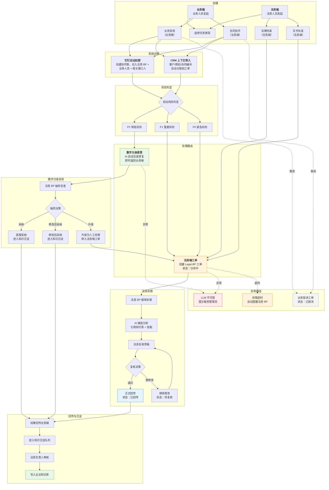

# 法务AI平台（Legal Workbench）功能清单

> 基于代码实际实现梳理 | 2026-07-30 | 待业务确认

---

## 一、平台整体架构

**统一入口登录**，根据角色权限展示不同工作端：

| 工作端 | 用户角色 | 定位 |
|--------|----------|------|
| **法务端** | 法务 BP、法务负责人 | 工单处理、法规检索、数字分身配置、知识库管理 |
| **业务端** | 业务人员（销售、采购、市场等） | 发起法律咨询、提交合同协作、获取 AI 即时答复 |
| **管理端** | 系统管理员、法务负责人 | 用户权限管理、AI 模型配置、定时任务管理、数据看板 |
| **系统对接** | — | 对接 CRM 系统（业务上下文带入与结果回写）、钉钉（自动拉群与消息通知） |

---

## 二、功能模块清单

---

### 模块 0：统一登录与权限管理

平台统一入口，基于角色控制功能可见性和操作权限。

| 序号 | 功能 | 说明 |
|------|------|------|
| 0.1 | 统一登录页 | 单一登录入口，所有用户通过同一页面登录 |
| 0.2 | 角色分配 | 三类角色：法务（法务 BP / 法务负责人）、业务人员、管理员 |
| 0.3 | 端侧路由 | 登录后根据角色自动进入对应工作端（法务端 / 业务端 / 管理端） |
| 0.4 | 权限控制 | 按角色限制功能模块和数据可见范围 |
| 0.5 | 账号管理 | 管理员可创建/禁用/编辑用户账号，分配角色 |
| 0.6 | 个人设置 | 各角色可修改个人信息、显示名称等 |
| 0.7 | 操作审计日志 | 关键操作记录（谁在什么时间对哪个工单做了什么），满足合规要求 |

---

### 模块 1：工单/项目管理【法务端核心模块】

法务工作的核心载体，所有法律任务以"项目/工单"形式进行全生命周期管理。

| 序号 | 功能 | 说明 |
|------|------|------|
| 1.1 | 工单创建 | 支持 4 种任务类型：业务咨询、合同协作、法律检索、文书生成 |
| 1.2 | 工单状态流转 | 分析中 → 待复核 → 已回传 / 待处理（失败）/ 已取消 |
| 1.3 | 风险分级 | 三级风险标签：P0（紧急）/ P1（重要）/ P2（常规），影响处理路由 |
| 1.4 | 工单列表 | 按状态分组：待处理工单、合同协作、已回传、数字分身处理 |
| 1.5 | 处理路由 | P2 走数字分身直答 → P1/P0 走 Legal BP 人工处理 |
| 1.6 | 对话式交互 | 每个工单支持多轮对话，消息角色包括：用户/助手/法务/事件通知 |
| 1.7 | 外部系统上下文 | 工单可携带来源系统信息（CRM / 钉钉），显示业务单据编号和摘要 |
| 1.8 | 最近工作 | 展示最近处理的项目列表 |
| 1.9 | 工单转派 | 法务 BP 之间转派工单（如原负责人请假、专业性不匹配等） |
| 1.10 | 附件管理 | 工单内上传/预览/下载附件（证据材料、合同文件、截图等） |
| 1.11 | 钉钉自动拉群 | 工单创建后自动在钉钉创建协作群，拉入法务 BP、业务人员和相关接口人，群内同步工单链接和处理进度 |
| 1.12 | CRM 系统对接 | 对接 CRM 系统，工单创建时自动带入客户/商机/合同等业务上下文，处理结果回写 CRM |

#### 工单流转图



---

### 模块 2：业务法律咨询【业务端核心模块 / 法务端处理模块】

业务人员提交法律问题，系统自动判断风险等级并分流处理。

| 序号 | 功能 | 说明 |
|------|------|------|
| 2.1 | 自由文本提问 | 业务人员用自然语言描述法律问题 |
| 2.2 | 自动风险判定 | 系统根据关键词自动识别高风险场景（无限责任/数据出境/跨境/个人信息/诉讼/监管/并购/股权等） |
| 2.3 | P2 低风险直答 | 低风险问题由 AI 数字分身直接答复，业务端即时获取结果 |
| 2.4 | P1/P0 高风险升级 | 高风险问题自动创建法务端工单，由法务团队人工处理 |
| 2.5 | 多轮对话 | 支持追问与澄清，对话历史保留同一会话内的所有历史 |
| 2.6 | AI 答复结构 | 按"核心结论 → 重点风险 → 建议动作 → 需补充确认"四段式输出 |
| 2.7 | 回传机制 | 法务处理结果自动回传至业务端的原始会话 |
| 2.8 | 服务不可用提示 | LLM 不可用时，系统提示"服务暂不可用，请联系法务平台管理员" |
| 2.9 | 满意度评价 | 业务端对 AI 直答和法务人工答复分别评分，作为数字分身效果和法务 BP 工作质量的衡量指标 |

---

### 模块 3：法规检索【法务端模块】

对接国家法律法规数据库，检索法规原文并结合 AI 进行法律释义。

| 序号 | 功能 | 说明 |
|------|------|------|
| 3.1 | 法规关键词检索 | 对接国家法律法规数据库（flk.npc.gov.cn），按关键词检索现行有效法规 |
| 3.2 | 法规原文获取 | 自动下载并解析法规 DOCX 原文，定位到具体法条 |
| 3.3 | 法条定位 | 从检索词中提取法条号（如"第十条"），精确定位对应条款 |
| 3.4 | AI 法律释义 | 结合法规原文，LLM 按"法条原文 / 法律分析 / 需确认事实"三段式输出 |
| 3.5 | 法规来源追溯 | 每条答复附带来源信息：法规标题、制定机关、公布/施行日期、效力状态、官方链接 |
| 3.6 | 效力状态标注 | 标注每条法规的效力状态：现行有效 / 已废止 / 已修改 / 尚未生效 |

---

### 模块 4：合同助手【业务端模块 / 法务端处理模块】

面向业务人员的合同起草与审阅辅助。

| 序号 | 功能 | 说明 |
|------|------|------|
| 4.1 | 合同模板选择 | 内置 3 类模板：渠道合作协议、技术服务合同、保密协议 |
| 4.2 | 需求输入 | 业务人员输入合同关键要素，系统生成合同草稿 |
| 4.3 | 合同协作工单 | 自动创建合同协作项目，发送至法务端审阅 |
| 4.4 | 合同风险审查 | AI 对合同条款进行风险识别和提示 |
| 4.5 | 合同下载 | 生成的合同草稿支持下载为 .docx 格式，供业务人员本地编辑使用 |
| 4.6 | 合同回传 | 业务人员本地编辑后上传修改版本，继续法务审阅，形成下载→编辑→上传→审阅的协作闭环 |
| 4.7 | 条款差异比对 | 支持上传新旧版本合同，AI 自动标注条款变更和差异点 |
| 4.8 | 合同模板管理【法务端】 | 法务负责人可自定义和维护合同模板库，支持新增、编辑、启用/停用模板 |

---

### 模块 5：AI 数字分身【法务端配置模块 / 业务端使用】

可配置的 AI 法务助手，自动处理 P2 级别的常规法律咨询。

> **实现方式**：接入李帅团队数字分身能力，本平台不做分身底层开发，只做配置管理和业务集成。

| 序号 | 功能 | 说明 |
|------|------|------|
| 5.1 | 分身基础配置 | 设置分身名称、人设与职责描述 |
| 5.2 | 回复口径设置 | 定义数字分身的回复风格和口径边界 |
| 5.3 | P2 授权范围 | 设定数字分身可自主处理的业务范围边界 |
| 5.4 | 直接升级条件 | 配置触发自动升级的条件规则（默认 4 条：紧急法律风险/重大合同/新业务类型/特殊行业合规） |
| 5.5 | 默认引用知识 | 指定数字分身默认引用的知识库条目 |
| 5.6 | 版本管理 | 每次修改自动递增版本号，历史版本可追溯 |
| 5.7 | 安全试运行 | 在配置端使用当前配置试跑测试问题，预览 AI 答复 |
| 5.8 | 答复复核 | 法务 BP 对数字分身答复进行抽检：直接采纳 / 修改后采纳 / 升级人工处理 |
| 5.9 | 版本追溯 | 每个工单记录调用的数字分身版本号 |

---

### 模块 6：技能库【法务端模块】

按法务实务领域组织的 AI 技能体系。

| 技能组 | 包含技能 |
|--------|----------|
| **合规法务** | 数据合规评估、营销授权核验、AI 研发合规 |
| **合同与交易** | 合同风险审查、条款差异比对、交易结构设计 |
| **劳动法务** | 员工关系咨询、竞业限制评估、用工风险体检 |
| **争议法务** | 争议焦点识别、证据链构建、类案检索 |
| **法律研究** | 法规原文检索、效力状态核验、新法影响分析 |
| **知识运营** | 知识条目沉淀、制度问答、工单复盘 |

共 **6 大技能组、18 项技能**，每个工单可选择对应技能来优化 AI 处理效果。

---

### 模块 7：知识库【法务端模块】

企业法律知识的沉淀、管理与引用体系。

| 序号 | 功能 | 说明 |
|------|------|------|
| 7.1 | 企业知识库 | 受控共享的知识条目，状态分"受控发布"和"待审核" |
| 7.2 | 个人知识库 | 法务个人私有知识空间，默认私有 |
| 7.3 | 知识条目管理 | 支持标题、描述、标签、状态管理 |
| 7.4 | 本地脱敏入库 | 支持上传/拖拽 .docx / .pdf / .txt 文件，本地自动脱敏后入库 |
| 7.5 | 6 类敏感信息识别 | 自动识别并脱敏：手机号、邮箱、身份证、银行卡、金额、订单号/合同号 |
| 7.6 | 脱敏预览 | 入库前预览脱敏效果，确认后提交 |
| 7.7 | 个人→企业提交 | 个人知识可提交至企业库，经法务负责人审核后发布 |
| 7.8 | 工单知识引用 | 每个工单可选择引用企业知识库或个人知识库条目 |
| 7.9 | 知识沉淀队列 | 已回传的优质工单自动进入待沉淀列表，经审核后写入企业知识库 |

---

### 模块 8：定时任务与自动化【管理端模块】

法务工作的周期性自动化提醒与报告。

| 序号 | 功能 | 说明 |
|------|------|------|
| 8.1 | 法务周报 | 每周自动统计项目完成情况和重点工作项 |
| 8.2 | 待回传工单提醒 | 每日检查待处理工单，自动提醒相关责任人 |
| 8.3 | 合同协作提醒 | 每日检查合同审阅进度，提醒未处理的合同协作 |
| 8.4 | 法规更新简报 | 每周检查法规变化，生成法规更新简报 |
| 8.5 | 自定义任务 | 支持创建自定义定时任务，配置名称、模板类型、调度周期 |
| 8.6 | 手动执行 | 支持手动触发任意定时任务立即执行 |
| 8.7 | 启用/暂停 | 每个定时任务可独立启用或暂停 |
| 8.8 | 执行记录 | 查看每个任务的执行历史和结果（最多保留 12 条） |
| 8.9 | 服务不可用提示 | LLM 不可用时，系统提示"服务暂不可用，请联系法务平台管理员"，与业务咨询保持一致 |

---

### 模块 9：AI 模型管理【管理端模块】

底层 LLM 能力的配置与监控。

| 序号 | 功能 | 说明 |
|------|------|------|
| 9.1 | 双模型后端 | 同时支持 OpenAI API 和 Anthropic API，通过环境变量切换 |
| 9.2 | 模型选择 | 前端可选择使用的 AI 模型，支持多个模型列表 |
| 9.3 | 模型健康检查 | 启动时检测模型 API 连通性，前端显示模型配置状态 |
| 9.4 | 三模式 API | 支持 OpenAI Responses / Chat Completions / Anthropic Messages 三种调用模式 |
| 9.5 | API 降级保护 | API 密钥未配置时返回空答复而非报错，UI 显示"本地优先"状态 |

---

## 三、角色与使用场景

| 角色 | 所属端 | 典型场景 | 涉及模块 |
|------|--------|----------|----------|
| **业务人员**（销售/采购/市场等） | 业务端 | 发起法律咨询 → P2 获取 AI 即时答复 / P1 升级法务 → 提交合同协作 → 接收法务意见 | 模块 0/2/4 |
| **法务 BP** | 法务端 | 接收业务工单 → AI 辅助分析 → 审核数字分身答复 → 正式回传 → 沉淀知识 | 模块 0/1/2/3/5/6/7 |
| **法务负责人** | 法务端 + 管理端 | 配置数字分身 → 审核企业知识库 → 查看周报 → 抽检答复质量 → 管理账号权限 | 模块 0/5/7/8/9 |
| **系统管理员** | 管理端 | 用户账号管理 → AI 模型配置 → 定时任务管理 → 系统运维 | 模块 0/8/9 |

---

## 四、三端功能视图

### 法务端

```
导航：工单管理 / 法规检索 / 技能库 / 企业知识库 / 个人知识库 / 知识沉淀 / 数字分身配置
```

- 工单处理（咨询 / 合同 / 检索 / 文书）
- 工单转派（法务 BP 之间转派）
- 附件管理（上传/预览/下载证据材料、合同文件等）
- 钉钉自动拉群（工单创建后自动建群协作）
- CRM 上下文查看（客户/商机/合同编号关联）
- 法规原文检索与 AI 释义
- 数字分身配置、试运行与版本管理
- 数字分身答复复核（采纳 / 修改 / 升级）
- 6 大技能组 18 项技能
- 企业/个人知识库管理与脱敏入库
- 知识沉淀审核
- 个人设置

### 业务端

```
导航：法律咨询 / 合同助手 / 我的记录
```

- 自然语言法律咨询（P2 直答 / P1 升级）
- 合同模板选择与需求提交
- 满意度评价（对 AI 和法务答复分别评分）
- 个人设置

#### 我的记录

| 序号 | 功能 | 说明 |
|------|------|------|
| - | 历史记录列表 | 按时间倒序展示所有咨询和合同记录，支持按状态筛选（处理中/已回传/已取消） |
| - | 继续追问 | 点击历史咨询可重新打开会话，继续追问或补充信息 |
| - | 完整对话查看 | 查看每次咨询的完整对话历史和最终答复 |
| - | 合同下载 | 已完成的合同草稿可从记录中下载 |
| - | 记录导出 | 支持将咨询记录导出为 PDF 或文本，用于存档或分享 |

### 管理端

```
导航：用户管理 / 定时任务 / AI 模型配置 / 数据看板
```

- 用户账号创建、角色分配、权限管理
- 合同模板管理（新增/编辑/启用/停用模板）
- 定时任务配置与监控（周报 / 提醒 / 简报 / 自定义）
- AI 模型选择与健康监控
- 操作审计日志查询
- 系统设置

#### 数据看板

| 序号 | 指标 | 说明 |
|------|------|------|
| 10.1 | 工单处理量统计 | 按时间段统计各类型工单的创建量、处理量、回传量 |
| 10.2 | 平均响应时间 | P0/P1/P2 工单的平均首次响应时长和平均处理时长 |
| 10.3 | 数字分身采纳率 | 数字分身直答复的采纳率、修改率、升级率趋势 |
| 10.4 | 热门咨询领域 | 业务咨询按领域标签的分布统计（销售/采购/HR/数据合规等） |
| 10.5 | 法务 BP 工作负载 | 各法务 BP 的工单处理量和平均处理时长 |
| 10.6 | 满意度趋势 | 业务端满意度的月度趋势和分布 |

---

## 五、当前实现状态说明

| 状态 | 模块 |
|------|------|
| **已完整实现** | 模块 1（工单管理）、模块 2（业务咨询）、模块 3（法规检索）、模块 5（数字分身）、模块 6（技能库）、模块 8（定时任务） |
| **已实现，待改造** | 模块 4（合同助手）— 当前合同生成为本地草稿模式，需改造为：合同模板选择 → AI 生成 → .docx 下载；条款差异比对改为上传版本对比 |
| **已实现，本地优先** | 模块 7（知识库）— 数据存储在浏览器 localStorage，脱敏在浏览器本地完成 |
| **已实现，依赖环境配置** | 模块 9（模型管理）— 需配置 API 密钥 |
| **待新建** | 模块 0（统一登录与权限管理 + 操作审计日志）— 当前代码无认证和审计机制，需从零搭建 |
| **外部对接** | 模块 5（数字分身）— 底层能力对接李帅团队，本平台负责配置管理与业务集成 |
| **新增需求（未实现）** | 1.9 工单转派、1.10 附件管理、1.11 钉钉自动拉群、1.12 CRM 系统对接、2.9 满意度评价、4.6 合同回传、4.8 合同模板管理、模块 10（数据看板）、业务端"我的记录" |

---

## 六、待业务确认事项

1. **角色细分**：法务端是否需要区分"法务 BP"和"法务负责人"两种角色？还是统一为法务角色？
2. **业务端角色**：业务端是否需要按部门（销售/采购/市场等）进一步细分权限？
3. **登录方式**：统一登录采用什么方式？企业 SSO / 邮箱密码 / 企微/飞书等 IM 快捷登录？
4. **合同模板**：当前仅 3 类模板（渠道合作/技术服务/保密协议），是否需要增加？模板是否需要法务端可自行维护？
5. **风险分级**：P0/P1/P2 三级风险判定标准是否准确？当前仅基于关键词匹配，是否需要更细粒度的规则？
6. **合同下载格式**：合同草稿下载为 .docx 是否满足需求？是否需要 .pdf 格式？
7. **知识库存储**：当前为浏览器本地存储，改为统一登录后是否同步升级为服务端持久化？
8. **数字分身对接**：李帅团队分身接口的具体对接方案和字段映射待确认
9. **CRM 对接**：对接哪个 CRM 系统？需要同步哪些字段（客户名称/商机编号/合同编号/业务类型等）？回写哪些结果？
10. **钉钉对接**：钉钉自动拉群的触发时机（工单创建时/法务接单时）？群内需要拉入哪些角色？群公告内容模板？
